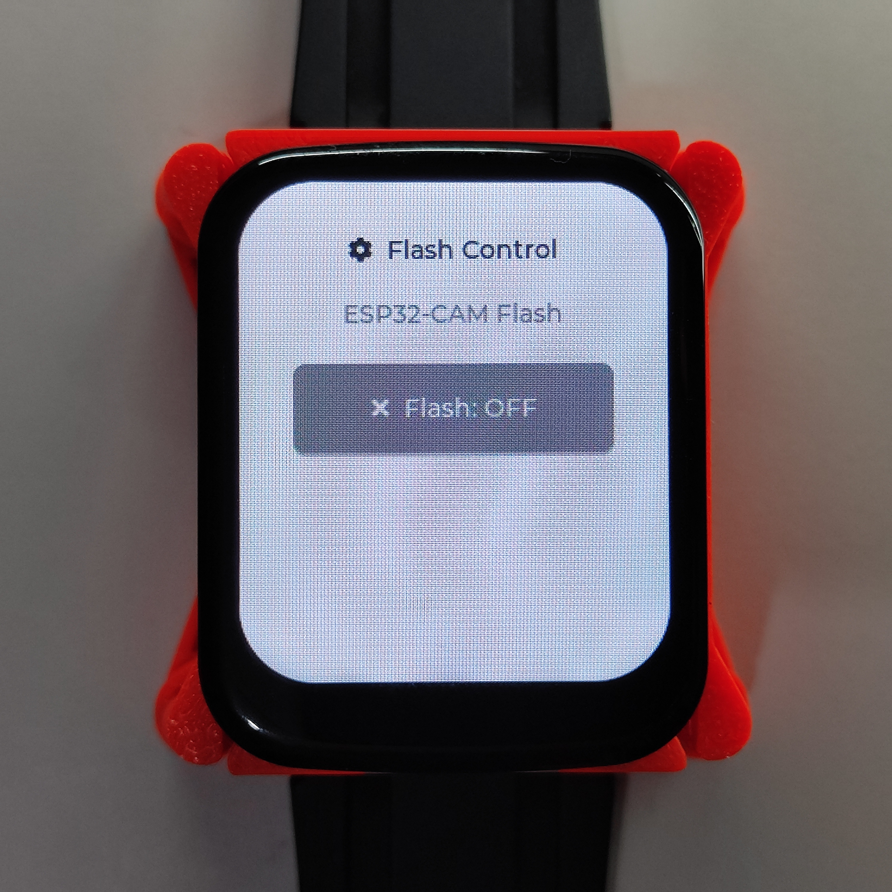
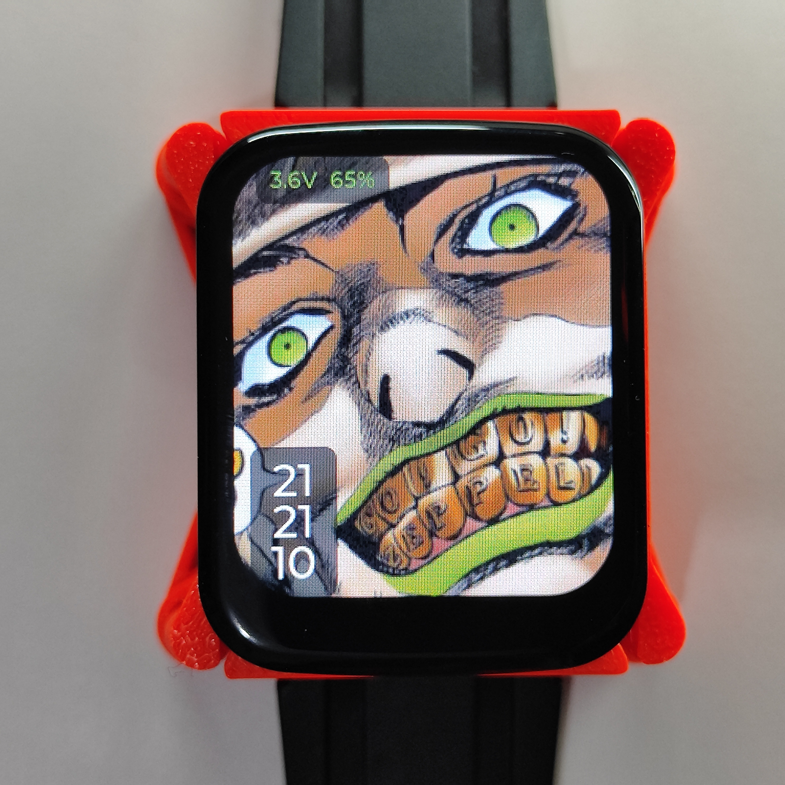
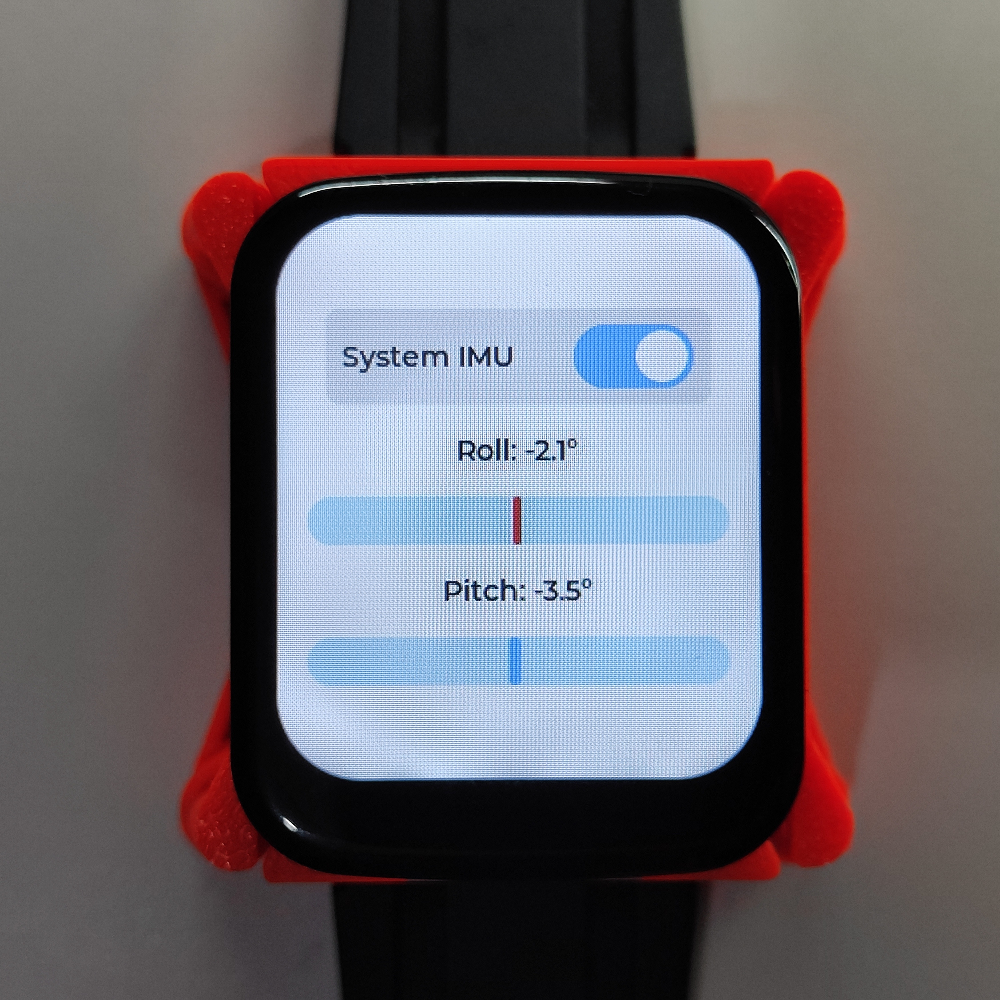
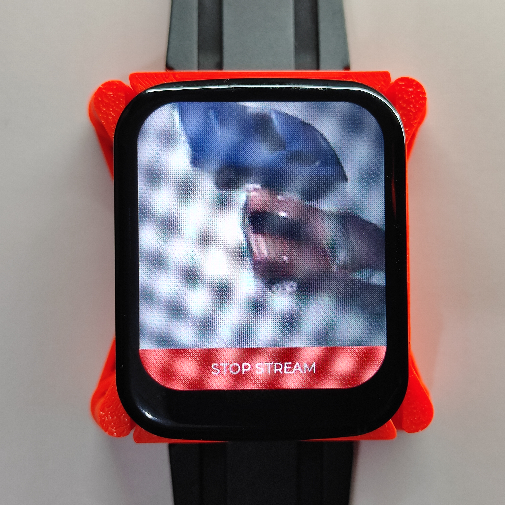
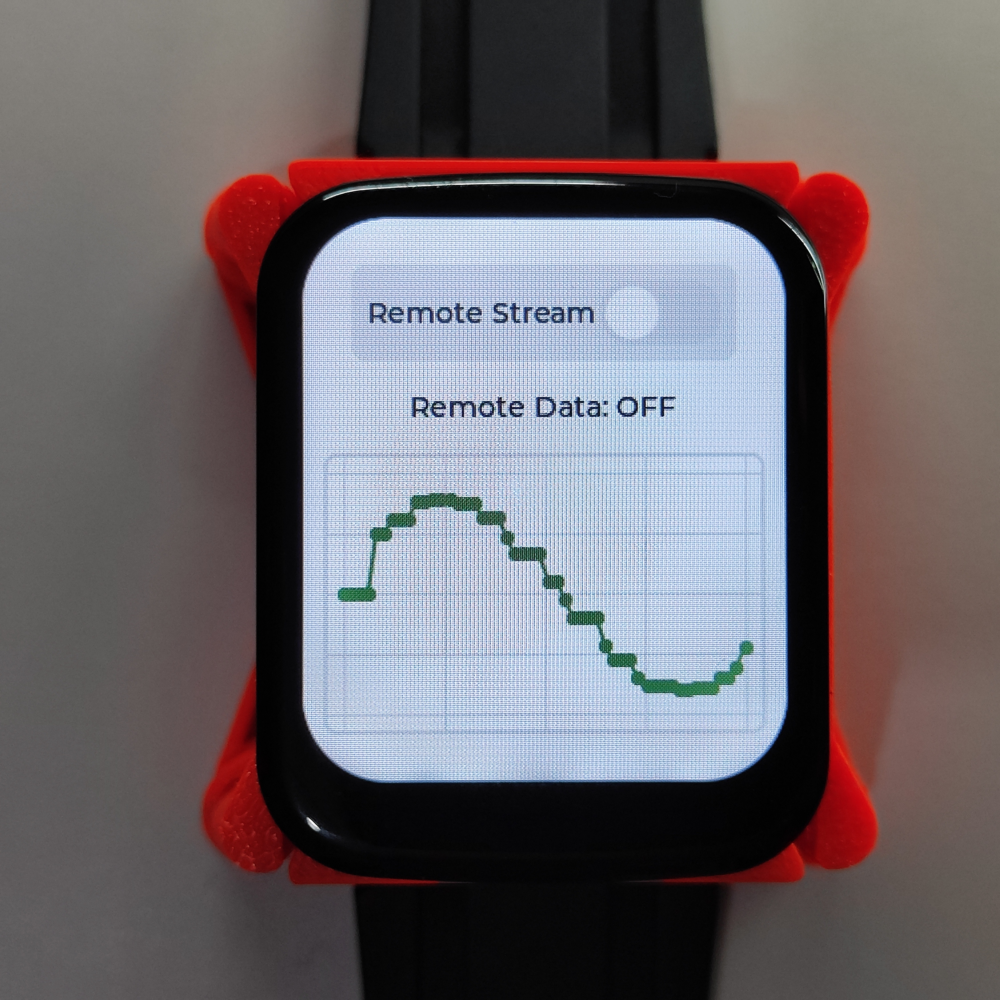
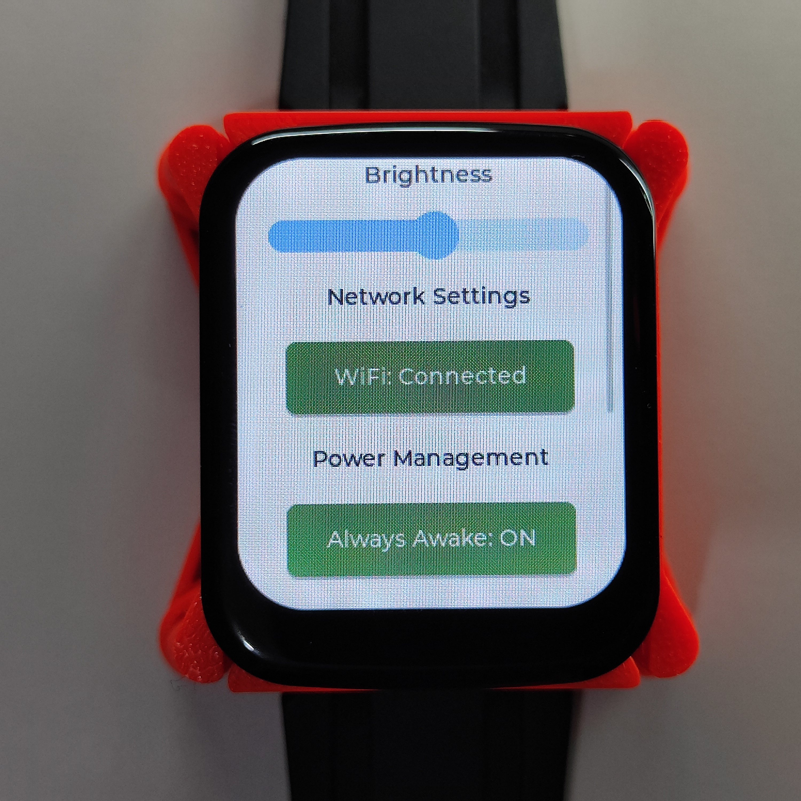
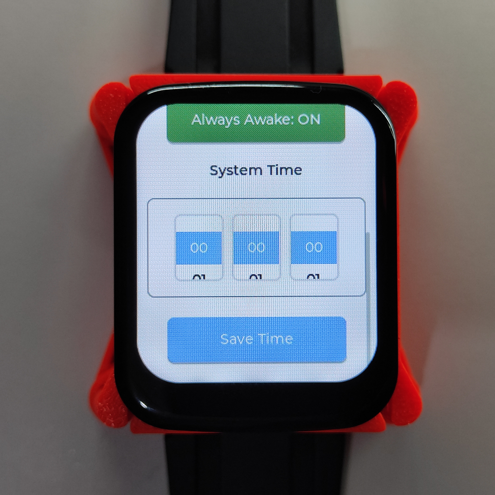

# ESP32-S3 SmartWatch Prototype

## Overview

This repository contains the firmware and 3D housing designs for an ESP32-S3 smartwatch prototype. The project consists of two firmware components: one for the main smartwatch module and one for an external ESP32-CAM peripheral. The system runs on FreeRTOS and uses LVGL for the user interface.

---

## Hardware Components

The primary hardware stack is based on the [ESP32-S3-Touch-LCD-1.69](https://docs.waveshare.com/ESP32-S3-Touch-LCD-1.69) module by Waveshare.

*   **Core Module:** Waveshare ESP32-S3-Touch-LCD-1.69
*   **MCU:** ESP32-S3 (Dual-core XTensa LX7 processor)
*   **Display:** 1.69 inch LCD with ST7789 controller (SPI)
*   **Touch Controller:** CST816S (I2C)
*   **Inertial Measurement Unit (IMU):** QMI8658C (6-axis accelerometer and gyroscope)
*   **Battery:** Power-Xtra PX103035
*   **External Camera Peripheral:** ESP32-CAM with OV2640 sensor (Wi-Fi/UDP/WebSocket)

---

## Features

### User Interface (LVGL)
*   **Navigation:** Tabview UI for switching between different application screens.
*   **Home Screen:** Displays time and battery status.
*   **IMU Dashboard:** Visualizes 6-axis accelerometer and gyroscope data.
*   **Remote Data Graphing:** Charts remote sensor telemetry streamed via local Wi-Fi UDP.
*   **Camera Stream \& GPIO Control:** Displays video feed and toggles GPIOs on a remote ESP32-CAM unit.

### Power Management
*   **Sleep States:** Uses an inactivity monitor to trigger light sleep.
*   **Wakeup Sequence:** Reinitializes the ST7789 controller and coordinates LEDC-driven backlight PWM fades on wakeup.
*   **System Locks:** Prevents sleep mode during background tasks like IMU polling, network communication, or camera streams.

---

## Project Structure

*   **/smartwatch-firmware:** Application firmware for the ESP32-S3 (Main device).
*   **/esp32cam-firmware:** Peripheral firmware for the remote ESP32-CAM module.
*   **/CAD:** 3D model files (STL/STEP) for the custom smartwatch enclosure.

---

## Building and Flashing

This project uses ESP-IDF.

### 1. SmartWatch Firmware

```bash
cd smartwatch-firmware
idf.py set-target esp32s3
idf.py build
idf.py -p /dev/ttyUSB0 flash monitor
```

### 2. ESP32-CAM Firmware

```bash
cd esp32cam-firmware
idf.py set-target esp32
idf.py build
idf.py -p /dev/ttyUSB1 flash monitor
```

*(Replace `/dev/ttyUSBX` with your serial port)*

---

## UI Design Showcase



### 1. Home Screen


### 2. IMU Dashboard


### 3. ESP32-CAM Stream


### 4. Remote Telemetry Graph


### 5. Settings Menu



